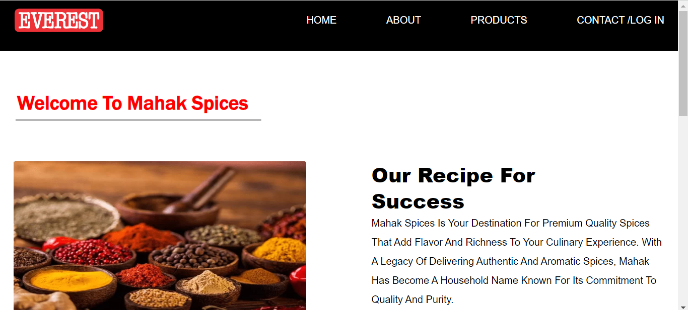
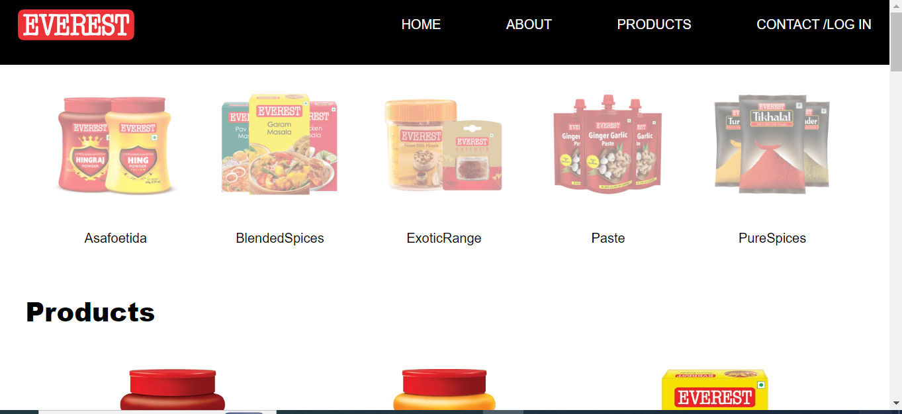
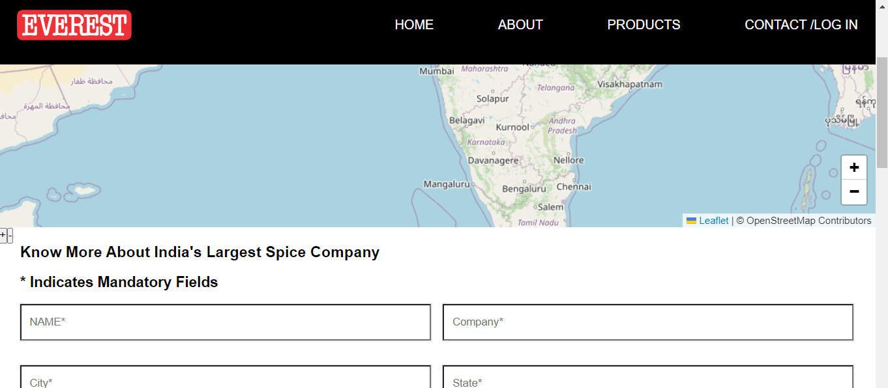

# Everest spices

this is a clone of everest spices , Everest Food Products Pvt Ltd is an Indian manufacturer, distributor and exporter of ground spices and spice mixtures under the brand name Everest.


## Acknowledgements
We extend our thanks to the following:

- **React**: This project is built using the React library, an open-source JavaScript library maintained by Facebook. The React community's dedication to providing a powerful and efficient front-end development experience is invaluable.

- **Font Awesome**: We leverage the icon font toolkit provided by Font Awesome. Their `@fortawesome/fontawesome-free` package enhances our project's visual appeal with a wide variety of scalable icons.

- **React Router**: A big thank you to the maintainers and contributors of `react-router-dom` for making navigation in React applications smooth and intuitive.

- **Axios**: We appreciate the simplicity and effectiveness of Axios, a promise-based HTTP client. Axios has streamlined our data fetching and API communication, contributing to the project's overall success.

These dependencies have significantly contributed to the success and functionality of our project. We extend our gratitude to the developers and communities behind these technologies.


## API Reference

### Get All Products
[```http]
GET /products


responsive format 

[
  {
    "id": 1,
    "image": "https://example.com/product1.png",
    "title": "Product 1",
    "name": "Product Name 1"
  },
  {
    "id": 2,
    "image": "https://example.com/product2.png",
    "title": "Product 2",
    "name": "Product Name 2"
  },
  // ... more products
]

get products by catagory

## Demo
- checkout my project-
[Everest spices](https://6560c102c12a4634d3b45027--stalwart-snickerdoodle-64adf9.netlify.app/)


this is home page with nav bar and some auto moving pics

this is recipee of defferent different products

product filtartion 

map for finding location

# Everest Spices App Documentation

## Project Structure

The project structure is organized to provide a clear and modular layout. Below is an overview of the main folders and their contents:

- **everest-spices-app:** The main folder for the Everest Spices App.

  ## Folders Inside `everest-spices-app`

  ### 1. `node models`
  - This folder contains models related to the Node.js backend.

  ### 2. `public`
  - The public folder typically contains static assets that are publicly accessible.

  ### 3. `src`
  - The `src` folder is the core of the application, containing various components, assets, and the main application files.

    #### Subfolders Inside `src`

    #### 3.1 `assets`
    - This folder stores static assets used in the application.

    #### 3.2 `components`
    - Components are organized into subfolders based on their functionality.

      ##### 3.2.1 `Body parts`
      - This section includes components related to the body of the application.
        - `acrossAllOverUser`
        - `information packages`
        - `product you love`
        - `recipee for you`
        - `subscribe page`

      ##### 3.2.2 `Footer`
      - Contains the footer component.
        - `footer.jsx`

      ##### 3.2.3 `Header`
      - The header components are organized into subfolders.
        - `lower Header`
        - `Upper header`

    #### 3.3 `HomePage`
    - Contains the main Home page component.
      - `Home page.jsx`

    #### 3.4 `RoutingComponents`
    - Components related to routing within the application.
      - `routingcomponents.jsx`

    #### 3.5 `App.css`
    - The stylesheet for the main application component.

    #### 3.6 `App.jsx`
    - The main application component.

    #### 3.7 `main.jsx`
    - The entry point for the application.

  ## Other Files in `everest-spices-app`

  - `.env`: Environment configuration file.
  - `.eslintrc.cjs`: ESLint configuration file.
  - `.gitignore`: Specifies files to be ignored by Git.
  - `db.json`: JSON file for local database storage.
  - `packages`: Folder for additional packages.
  - `README file`: Documentation file providing an overview of the project.

This structured approach ensures a clean organization of files and components within the Everest Spices App. Adjustments can be made as the project evolves or based on specific requirements.


## Features


- Fullscreen mode
- Cross platform
- full responsive
- filter 
- hover good style 
- icon style effect
- map for location

## 🔗 Links

[](https://www.linkedin.com/in/harshit-sharma-552038236/)
[](https://twitter.com/sharmaharshit26)


## Installation

Install my-project with npm

```bash
  npm install my-project
  cd my-project
```
json-server --watch db.json  --port 300